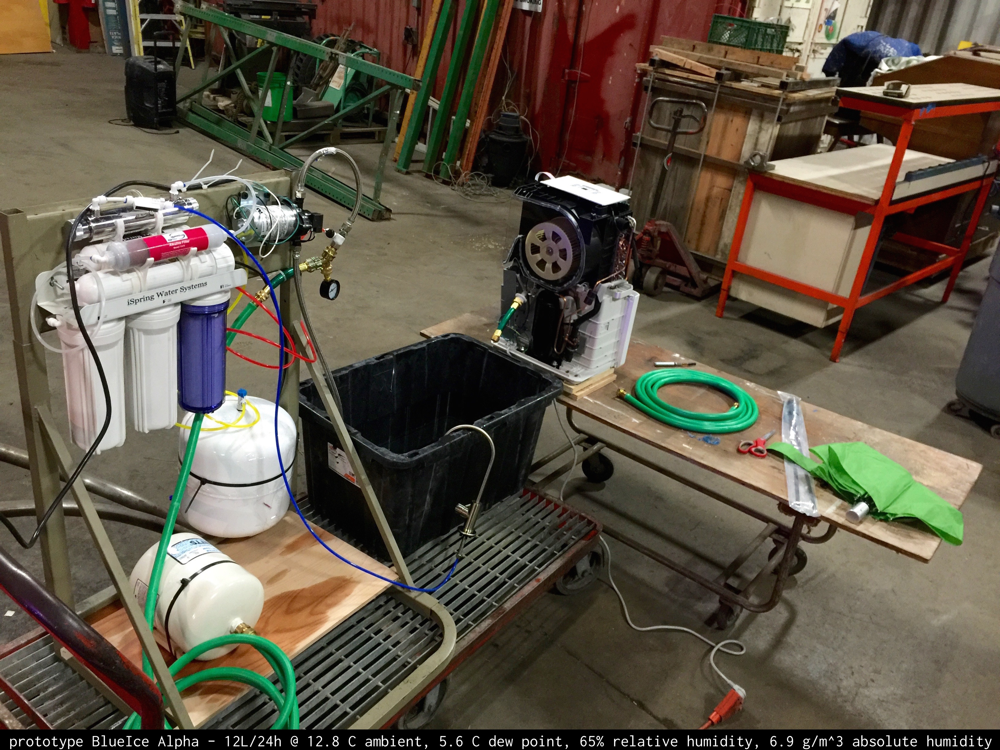
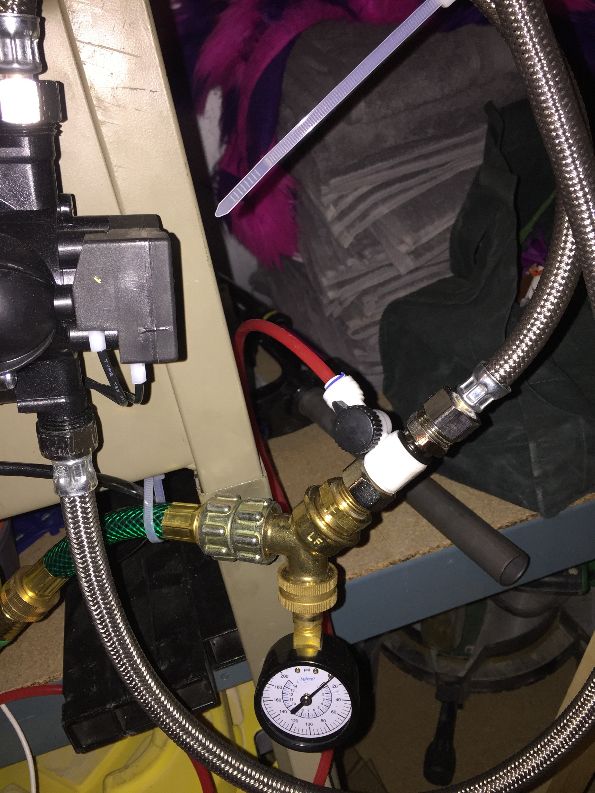
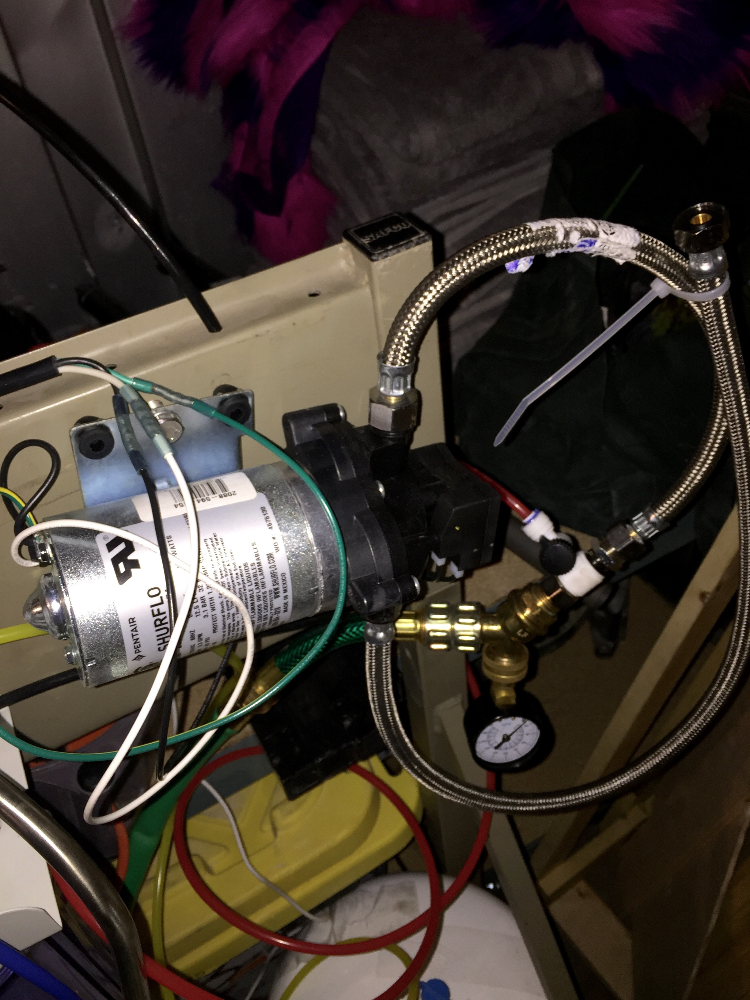
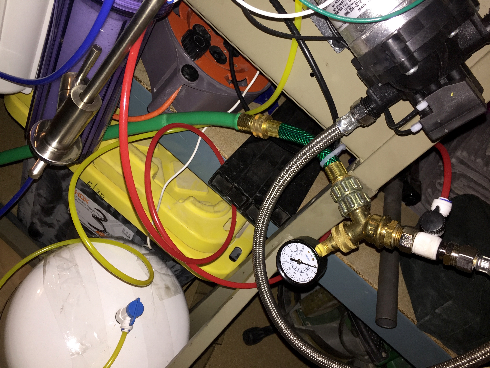
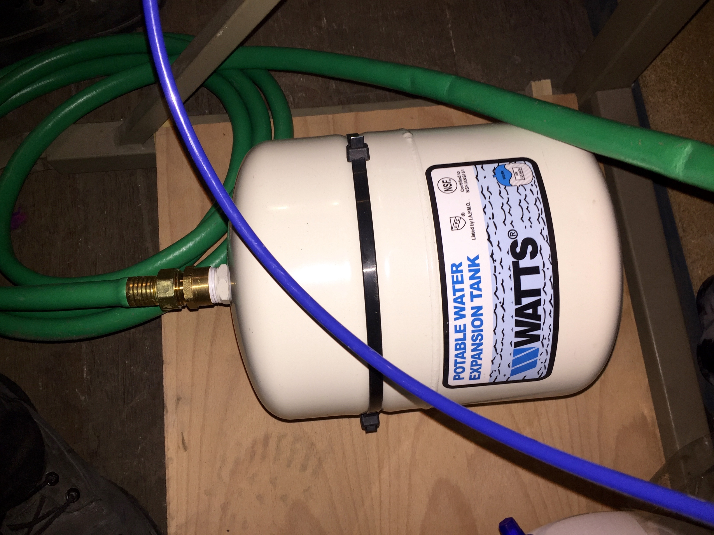
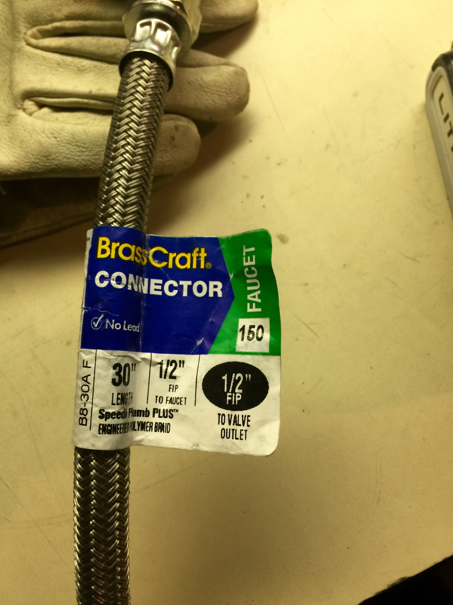

# BlueIce Alpha


# Bill of Materials
|Qty.|part/model|name|link|
|---|---|---|---|
|1|KSTAD70B|Keystone Energy Star 70 Pt. Dehumidifier|http://amzn.com/B00CEZA018|
|1|n/a|30 gallon collection bucket|n/a|
|2|B8-30A F|Brass Craft 1/2" FIP 30" faucet connector|n/a|
|1|2088-594-154|SHURflo 115v water pump|http://amzn.com/B0001FAA5Y|
|1|RCC7AK-UV|7 stage iSpring reverse osmosis filter|http://amzn.com/B006T3HYQ0|
|1|n/a|1/2" MIP to 3/4" male garden hose thread adapter|n/a|
|1|n/a|female garden hose thread pressure gauge|n/a|
|1|n/a|female garden hose thread to (2) 3/4" male garden hose thread y-splitter|n/a|
|1|n/a|5 ft garden hose|n/a|
|1|n/a|3/4" male garden hose thread to 3/4" FIP|n/a|
|1|DET-5|Watts water heater expansion tank with 3/4" MIP thread|n/a|
|1|n/a|roll of teflon tape for expansion tank connection|n/a|

# Connections
(x => y) denotes adapter

```
30 gallon bucket to 1/2" FIP hoseA
hoseA to SHURflo pump to 1/2" FIP hoseB
1/2" FIP hoseB to iSpring RO system hookup T split to 1/8" poly tubing
iSpring RO system hookup T split to (1/2" MIP => (2) 3/4" male garden hose y-splitter)
3/4" male garden hose y-splitter to 3/4" female garden hose thread pressure gauge
3/4" male garden hose y-splitter to garden hose
3/4" garden hose to (3/4" male garden hose thread => 3/4" FIP)
3/4" FIP to water heater expansion tank
```

# Pictures





